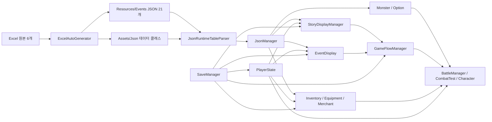

# Adventure 프로젝트 분석서

- 작성일: 2026-08-03 (Asia/Seoul)
- 분석 대상: `Adventure/JsonFile`
- 기준 리비전: `d25c5875503a2c4b562bbb5b6f5dfe6a1d04d4c3` (`main`)
- Unity: `2022.3.62f3`
- 분석 방식: 저장소·씬 YAML·설정·코드·데이터·QA 산출물 정적 분석 + Unity batchmode 검증
- 작업 트리 주의: 분석 시작 전부터 `ProjectSettings/ProjectSettings.asset`가 수정된 상태였으며, 본 분석에서는 해당 변경을 편집하지 않았다.

## 1. 요약 결론

Adventure는 모바일용 텍스트 스토리 RPG다. 메인 스토리와 랜덤 이벤트가 교차하고, 선택지 판정·전투·장비·상점·보상·로컬 저장이 하나의 플레이 루프를 구성한다. 콘텐츠는 Excel 원본을 JSON과 C# 데이터 클래스로 변환한 뒤 `Resources/Events`에서 읽는 데이터 주도 구조다.

현재 프로젝트는 프로토타입을 넘어 기능 통합과 회귀 검증이 이루어진 상태다. 데이터 계약, 장비 옵션, 몬스터 패시브, 씬 순서를 다루는 EditMode 테스트 71개와 씬 로딩·시작 버튼 흐름을 다루는 PlayMode 테스트 4개가 2026-08-03 현재 모두 통과했다.

다만 “테스트가 통과한다”와 “출시 안정성이 확보됐다”는 같은 의미가 아니다. 가장 시급한 문제는 저장 시스템이다. PlayMode 테스트가 테스트 전용 저장 경로를 사용하지 않아 실제 사용자 저장 파일을 덮어쓰며, 저장 스키마에는 플레이에 쓰이는 `DIV`, `CurrentHealth`, `CurrentMental`이 없다. 또한 경험치가 재화 역할까지 겸하고, 초기값이 100000으로 직렬화되어 있어 출시 전 분리가 필요하다.

종합 판단은 다음과 같다.

- 콘텐츠·전투·옵션 시스템의 기능 범위: 양호
- 데이터 계약 자동 검증: 강점
- 저장 데이터 안전성: 즉시 보완 필요
- 출시 설정과 디버그 기능 분리: 즉시 보완 필요
- 코드 유지보수성: 중간 이하
- Android 실기기·IL2CPP·광고·GPGS 검증: 미확인

## 2. 프로젝트 규모와 구성

| 항목 | 현재 상태 |
|---|---|
| 장르 | 텍스트 스토리 RPG + 어드벤처 |
| 목표 플랫폼 | 모바일, 현재 Android 설정 중심 |
| 제품명 | `Adveturer'sJournal` |
| 번들 버전 | `0.63.0` |
| Android 번들 코드 | `8` |
| Android 최소 SDK | 24 |
| Android 스크립팅 백엔드 | IL2CPP |
| 빌드 씬 | `LobbyScenes` → `GameScene` → `GameEndingScene` |
| 런타임 C# 스크립트 | 58개 |
| 승인 테스트 소스 | EditMode 1개, PlayMode 1개 |
| 이벤트 JSON | 21개 |
| Excel 원본 | 6개 |
| 핵심 외부 구성 | TextMeshPro, uGUI, DOTween, Google Mobile Ads, Google Play Games, Spine, SRDebugger, Newtonsoft Json |

기획서의 목표와 비교하면 로컬 데이터·로컬 저장·광고·GPGS 로그인은 코드에 존재하지만, 서버 JSON 다운로드·서버 저장·리더보드 점수 제출 코드는 확인되지 않았다. 현재 구현은 기본적으로 오프라인 로컬 게임 구조다.

## 3. 전체 아키텍처

### 3.1 씬별 책임

| 씬 | 역할 | 주요 런타임 구성 |
|---|---|---|
| `LobbyScenes` | 앱 진입, 영속 서비스 생성, 새 게임·불러오기, 패치 노트, 로그인·광고 초기화 | `JsonManager`, `SaveManager`, `PlayerState`, `SpriteBank`, `OptionManager`, `MonsterOptionManager`, `SceneFader`, `AdMobManager`, `GoogleManager` |
| `GameScene` | 실제 플레이 전체 | `GameFlowManager`, `StoryDisplayManager`, `EventDisplay`, `BattleManager`, `CombatTest`, `Character`, `EquipmentSystem`, `InventoryManager`, `MerchantManager`, UI 계층 |
| `GameEndingScene` | 저장 데이터 기반 최종 점수 표시 | `GameEndingManager` |
| `OptionScene`, `CodeTestScene` | 보조·테스트 씬 | 빌드 설정에서 제외 |

로비에서 만든 다수의 싱글톤이 `DontDestroyOnLoad`로 게임 씬까지 유지된다. 따라서 정상 부팅 경로는 `LobbyScenes`에서 시작해야 한다. `GameScene`을 단독 실행하면 `JsonManager`, `OptionManager`, `MonsterOptionManager`, `SaveManager`가 없을 수 있고, 일부 시스템은 `FindObjectOfType` 또는 제한 시간 대기로 이를 보완한다. 이 구조는 개발 중 직접 씬 실행과 자동 테스트에서 놓치기 쉬운 결합점이다.

### 3.2 게임 진행 흐름

`GameFlowManager`는 `None`, `MainStory`, `RandomEvent`, `Battle` 상태를 가진다.

1. 새 게임에서 능력치를 무작위 생성한다.
2. 메인 스토리를 시작한다.
3. 메인 스토리가 끝나면 랜덤 이벤트로 이동한다.
4. 스토리 또는 이벤트 데이터가 전투를 지시하면 몬스터를 생성하고 전투로 전환한다.
5. 승패 결과를 원래 스토리·이벤트 흐름에 전달한다.
6. 전투 패배 시 스토리 체력과 정신력을 감소시키며, 둘 중 하나가 0 이하이면 엔딩 씬으로 이동한다.

스토리 출력 타입은 `TEXT`, `IMAGE`, `BATTLE`, `MERCHANT`를 중심으로 분기한다. 랜덤 이벤트는 `TEXT`, `IMAGE`, `BATTLE`을 처리한다. 선택지는 `ChoiceEvaluator`, `ConditionEvaluator`, `ChoiceBranchResolver`, `ChoiceRequirementResolver`, `StoryNodeNavigator`로 일부 책임이 분리되어 있다.

### 3.3 전투·장비·옵션 흐름

- `MonsterSpawner`가 `Mon_Master` 데이터로 적 `Character`를 구성한다.
- `EquipmentSystem`이 장착 아이템을 `JsonManager`에서 조회하고 `OptionManager`에 옵션 적용을 요청한다.
- `OptionManager`는 `OnEquip`, `OnHit`, `OnBattleStart` 효과를 등록·실행한다.
- `MonsterOptionManager`는 몬스터 패시브 슬롯을 수집해 전투 시작 또는 공격 시점에 실행한다.
- `CombatTest`가 선공 판정, 시간 기반 공격 루프, 버프 적용, 승패·보상·엔딩 전환을 조립한다.
- `Character`가 실제 공격, 피해, 치명타, 상태 이상, 버프 수명과 저항을 처리한다.

기능은 넓지만 `Character` 1,628줄, `OptionManager` 1,033줄, `CombatTest` 400줄에 핵심 규칙이 집중되어 있어 변경 영향 범위가 크다.

## 4. 데이터 파이프라인

### 4.1 원본과 생성물

Excel 원본은 다음 6개다.

- `TRPG_ScriptData.xlsx`
- `TRPG_EventScriptData.xlsx`
- `Patch_Note.xlsx`
- `Monster_Data.xlsx`
- `Merchant's items.xlsx`
- `AllItem_Master.xlsx`

`Tools/Excel Auto Generator`가 JSON과 `Assets/Json`의 데이터 클래스를 생성한다. 런타임에서는 `JsonManager`가 `Resources.LoadAll<TextAsset>("Events")`로 데이터를 읽고, `JsonRuntimeTableParser`가 루트 배열과 필드 별칭을 정규화한다.

### 4.2 현재 검증된 주요 레코드 수

2026-08-03 EditMode 테스트가 아래 수량을 실제 파싱해 검증했다.

| 데이터 | 레코드 수 |
|---|---:|
| 메인 스토리 노드 | 93 |
| 메인 스크립트 | 93 |
| 랜덤 이벤트 노드 | 46 |
| 랜덤 이벤트 스크립트 | 50 |
| 무기 | 46 |
| 방어구 | 44 |
| 일반 아이템 | 20 |
| 상점 항목 | 88 |
| 런타임 옵션 | 18 |
| 옵션 제작 메타데이터 | 18 |
| 몬스터 | 13 |

### 4.3 데이터 관련 구조적 위험

21개 JSON은 모두 UTF-8이지만, 그중 11개는 표준 PowerShell JSON 파서로 읽히지 않았다. 프로젝트는 다음 순서로 이를 복구한다.

1. Newtonsoft `JObject.Parse` 시도
2. 줄 끝에서 닫히지 않은 문자열 보정
3. 줄 단위 느슨한 테이블 파서로 객체 재구성

현재 테스트가 수량과 주요 참조 무결성을 지키고 있으므로 즉시 런타임 오류로 단정할 수는 없다. 그러나 느슨한 파서는 잘못된 속성을 조용히 문자열로 바꾸거나 누락할 수 있어, 생성 데이터가 더 복잡해질수록 원본 결함을 숨길 가능성이 높다. 장기적으로는 Excel 변환기에서 표준 JSON을 보장하고 복구 파서를 호환 계층으로만 남겨야 한다.

또한 런타임 스크립트 58개 중 21개가 엄격한 UTF-8 파일이 아니다. 현재 Windows 기본 코드페이지에서는 한글이 보이지만, 다른 PC·CI·macOS에서 주석과 UI 문자열이 깨질 수 있다.

## 5. 저장 시스템 분석

### 5.1 현재 구조

`SaveManager`가 `PlayerState`, `GameFlowManager`, `StoryDisplayManager`, `EventDisplay`, `InventoryManager`에 저장을 위임하고 `Application.persistentDataPath/save.json`에 `JsonUtility` 형식으로 기록한다. 저장 클래스의 필드명은 EditMode 계약 테스트로 보호된다.

### 5.2 즉시 수정해야 할 문제

#### P0-SAVE-01: PlayMode 테스트가 실제 저장 파일을 덮어씀

`SaveManager`에는 `SetSavePathForTesting`과 `ClearSavePathForTesting`이 있지만, `P0PlayModeSmokeTests`는 이를 사용하지 않는다. `LobbyStartButtonLoadsGameScene`가 실제 시작 버튼을 누르면서 `SaveGame()`까지 실행한다.

2026-08-03 검증 중 실제로 다음 파일이 갱신되었다.

- 경로: `C:/Users/pc/AppData/LocalLow/pofol2025Company/Adveturer'sJournal/save.json`
- 파일 생성 시각: 2025-08-19 17:59:27
- 테스트에 의한 수정 시각: 2026-08-03 10:07:17
- 같은 폴더에서 별도 백업 파일은 확인되지 않음

즉, 테스트는 통과했지만 테스트 격리는 실패했다. PlayMode 테스트 시작 전 임시 경로를 설정하고 종료 시 원복하는 장치가 최우선이다.

#### P0-SAVE-02: 실제 플레이 상태 일부가 저장 스키마에 없음

플레이어가 사용하는 `DIV`, `CurrentHealth`, `CurrentMental`은 `SaveData`에 없고 `SavePlayer`와 `LoadPlayer`에서도 저장·복원되지 않는다. 불러오기 후 선택지 판정과 게임 오버 자원이 저장 전 상태와 달라질 수 있다.

#### P0-SAVE-03: 빈 기본 저장 파일 자동 생성

`autoCreateOnBoot` 기본값이 켜져 있고, 저장 파일이 없으면 대부분의 값이 0인 `CreateDefaultSave()`를 즉시 기록한다. 첫 실행에서 게임을 시작하지 않고 종료해도 다음 실행에는 “저장 파일 있음”으로 판단될 수 있다. 불러오기 버튼 노출과 유효 저장 판정을 분리해야 한다.

### 5.3 저장 계약 수정 원칙

- 기존 필드명을 삭제하거나 변경하지 않는다.
- `saveSchemaVersion`과 새 필드를 추가하고 구버전 기본값을 명시한다.
- 원자적 저장(`.tmp` 기록 후 교체)과 최근 백업 1개를 둔다.
- 저장 유효성 검사를 통과한 파일만 불러오기 버튼을 활성화한다.
- EditMode와 PlayMode 모두 임시 저장 경로를 강제한다.

## 6. 강점

### 6.1 데이터와 런타임 계약을 자동화함

단순 파일 존재 검사를 넘어 루트 키, 레코드 수, 아이템 ID, 상점 참조, 옵션 효과 ID, 몬스터 패시브, 빌드 씬 순서, 저장 필드 호환성을 테스트한다. 콘텐츠가 많은 게임에서 가장 실용적인 회귀 방어선이다.

### 6.2 생성 테스트 후보를 승인 테스트와 분리함

이전 자동 생성 테스트는 현재 `memory/QA_Portfolio/Candidates/generated_test_drafts`에 격리되어 있다. 실제 테스트 결과에는 승인된 테스트만 포함시키는 경계가 저장소 구조에 반영되어 있다.

### 6.3 선택지 로직이 일부 순수 함수로 분리됨

`ChoiceEvaluator`, `ConditionEvaluator`, `StoryNodeNavigator`는 MonoBehaviour 의존성이 비교적 작고 테스트하기 쉽다. 향후 스토리 시스템 리팩터링의 좋은 기준점이다.

### 6.4 옵션 시스템의 데이터 연결이 비교적 잘 검증됨

장비 옵션과 몬스터 패시브가 실제 등록된 효과를 가리키는지, 전투 시작·공격 시 효과가 적용되는지 테스트가 존재한다. 데이터 추가 시 깨지기 쉬운 구간을 자동으로 보호한다.

### 6.5 민감 파일이 Git에서 제외됨

로컬 keystore와 `google-services.json`은 현재 `.gitignore` 규칙으로 제외되어 있다. 공개 저장소 준비 관점에서 올바른 기본 상태다.

## 7. 위험과 기술 부채

| 우선순위 | 문제 | 영향 | 근거 |
|---|---|---|---|
| P0 | PlayMode 테스트가 실제 저장 파일 사용 | 사용자 진행 데이터 손상 | 실제 batchmode 실행에서 기존 `save.json` 수정 확인 |
| P0 | `DIV`, 현재 체력·정신력 미저장 | 불러오기 후 상태 불일치 | `PlayerState`에는 있으나 `SaveData`에 없음 |
| P0 | 초기 `Experience`가 100000 | 출시 빌드 경제·성장 밸런스 파괴 | 코드와 Lobby/GameScene 직렬화 값 모두 100000 |
| P0 | 디버그 도구가 GameScene에 포함 | 출시 빌드에서 콘텐츠·아이템·전투 강제 가능 | `RemoteTester`, 여러 `DebugButton_*`, SRDebugger 존재 |
| P1 | 경험치와 골드가 같은 변수 | 구매가 레벨 진행도를 줄이고 보상이 경제와 성장을 동시에 변경 | 상점·골드 UI·레벨업이 모두 `Experience` 사용 |
| P1 | 빈 기본 세이브 자동 생성 | 유효하지 않은 저장을 불러올 수 있음 | `autoCreateOnBoot = true`, 기본값 대부분 0 |
| P1 | 비표준 JSON을 느슨한 파서가 복구 | 원본 결함 은폐, 데이터 증가 시 누락 가능 | 21개 중 11개가 표준 파서 실패 |
| P1 | 로비 부팅 순서와 싱글톤 의존 | GameScene 단독 실행·테스트·씬 재진입 취약 | 영속 매니저가 LobbyScenes에 집중 |
| P1 | GPGS 로그인 3회 실패 시 앱 종료 | 네트워크·계정 장애가 로컬 게임 진입을 막음 | `GoogleManager.SignIn()` 실패 분기 |
| P1 | 비 UTF-8 C# 파일 21개 | CI·타 OS에서 한글 UI·컴파일 재현성 저하 | 엄격한 UTF-8 디코딩 검사 |
| P1 | 서버 저장·원격 JSON·리더보드 제출 미구현 | 기획서와 실제 구현 범위 차이 | 네트워크 클라이언트와 점수 제출 호출 미발견 |
| P2 | 스토리·이벤트 표시 코드 중복 | 한쪽만 수정되어 동작이 갈라질 위험 | 두 클래스에 동일 이름 메서드 14개, 각 1,000줄 수준 |
| P2 | 핵심 파일에 구버전 주석 코드가 대량 잔존 | 리뷰·수정 속도 저하, 잘못된 코드 수정 가능 | `Character` 주석 628줄, `OptionManager` 301줄 등 |
| P2 | `FindObjectOfType`와 싱글톤 혼용 | 초기화 순서와 숨은 의존성 증가 | 저장·장비·전투·UI 전반에서 재탐색 |
| P2 | Unity MCP 패키지가 Git `main` 참조 | 새 환경 복원 시 의존성 변동 가능 | `Packages/manifest.json`이 브랜치 참조 |

## 8. 리팩터링 우선순위

### 1단계: 저장과 출시 안전장치

1. 모든 테스트에서 임시 저장 경로를 강제한다.
2. 현재 저장 파일을 백업하고 원자적 저장을 도입한다.
3. `saveSchemaVersion`, `DIV`, `CurrentHealth`, `CurrentMental`을 추가한다.
4. 빈 기본 세이브와 유효 플레이 세이브를 구분한다.
5. `Experience`와 `Gold`를 분리하고 구버전 마이그레이션 규칙을 만든다.
6. 출시 빌드에서 `RemoteTester`, SRDebugger, 디버그 버튼, F7 초기화를 제거하거나 컴파일 심볼로 차단한다.

### 2단계: 데이터 생성 신뢰성

1. 6개 Excel 원본에서 JSON을 전부 재생성한다.
2. 생성 직후 표준 JSON 파싱, 루트 키, 행 수, ID 중복·참조를 검사한다.
3. 느슨한 런타임 복구 파서 사용 시 오류가 아니라 경고와 파일명을 수집한다.
4. C#·에디터 스크립트를 UTF-8로 일괄 정규화하고 한글 UI 스모크 검사를 추가한다.

### 3단계: 런타임 결합 완화

1. `StoryDisplayManager`와 `EventDisplay`에서 공통 렌더러·선택지 UI·전투 진입 어댑터를 추출한다.
2. `Character`를 피해 계산, 상태 효과, 공격 실행, 전투 UI 알림으로 분리한다.
3. `OptionManager`의 효과 등록과 실행을 순수 레지스트리로 분리한다.
4. `Bootstrap` 씬 또는 명시적 서비스 조립기를 두어 `GameScene` 단독 실행도 안전하게 만든다.

### 4단계: 서비스와 배포 검증

1. GPGS 실패 시 오프라인 진행을 허용한다.
2. 리더보드 제출과 실패 재시도 정책을 별도 서비스로 구현한다.
3. 광고 테스트 ID·운영 ID와 개인정보 동의 흐름을 출시 설정으로 분리한다.
4. Android IL2CPP 빌드, 실제 단말 씬 전환, 광고·로그인, 저장 복원, 앱 업데이트 마이그레이션을 검증한다.

## 9. 수정 시 특히 조심해야 할 계약

- `SaveData`의 기존 공개 필드명은 구버전 저장 호환 계약이다. 삭제·이름 변경 대신 필드 추가와 마이그레이션을 사용한다.
- 빌드 씬의 활성화 순서 `LobbyScenes` → `GameScene` → `GameEndingScene`은 테스트와 부팅 구조가 의존한다.
- `Option_ID`, `Effect_ID`, `Item_ID`, `MonPas_Effect*` 연결은 Excel·JSON·런타임 레지스트리·테스트를 함께 변경해야 한다.
- 장비 추가는 `AllItem_Master.xlsx`, 생성 JSON, `BlackSmith.json`, 아이콘 리소스, 행 수 계약을 함께 갱신해야 한다.
- 표준 JSON 재생성이 끝나기 전에는 `JsonRuntimeTableParser`의 복구 경로를 제거하면 안 된다.
- `StoryDisplayManager`와 `EventDisplay`는 비슷하지만 저장 필드와 완료 콜백이 다르므로 단순 파일 병합보다 공통 하위 계층 추출이 안전하다.
- `memory/QA_Portfolio/Candidates`의 초안은 승인 테스트가 아니다. 검토·오라클 확정 없이 `Assets/Tests`로 이동하면 안 된다.

## 10. 검증 결과

### 이번 분석에서 실제 실행한 항목

| 검증 | 결과 | 실행일 |
|---|---|---|
| Unity EditMode | 71/71 Passed, 실패·스킵 0 | 2026-08-03 |
| Unity PlayMode | 4/4 Passed, 실패·스킵 0 | 2026-08-03 |
| 빌드 씬 설정 | 3개 필수 씬 활성·순서 확인 | 2026-08-03 |
| Git 상태 | `ProjectSettings.asset` 기존 수정 외 추가 추적 변경 없음 | 2026-08-03 |
| 민감 파일 추적 여부 | keystore와 `google-services.json` Git 제외 확인 | 2026-08-03 |

### 이번 분석에서 실행하지 않은 항목

- Android APK/AAB 빌드
- IL2CPP 실제 컴파일과 서명
- Android 실기기 실행
- 광고 요청과 보상 지급 실사용 검증
- GPGS 실제 계정 로그인과 리더보드 제출
- 프레임·메모리·로딩 시간 프로파일링
- 전체 수동 UI·스토리·현지화 QA
- 서버 저장·원격 JSON 검증(현재 구현 자체를 찾지 못함)

## 11. 권장 다음 작업

첫 작업 묶음은 기능 추가가 아니라 저장 안전성 회복이 적절하다.

1. PlayMode 테스트 저장 경로 격리
2. 기존 저장 파일 백업 정책 추가
3. 저장 스키마 버전과 누락 필드 추가
4. Gold/Experience 분리 및 이전 저장 마이그레이션
5. 디버그 UI와 100000 초기값의 출시 차단
6. 위 변경 후 EditMode·PlayMode·Android 로컬 빌드 재검증

이 순서라면 기존 콘텐츠 계약을 유지하면서 가장 큰 데이터 손실·출시 위험부터 줄일 수 있다.
